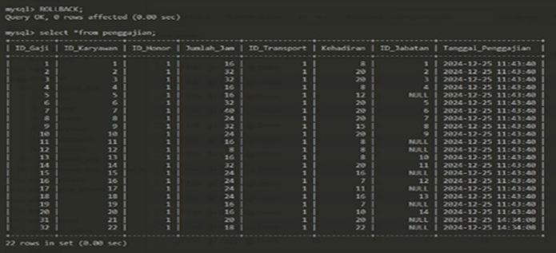
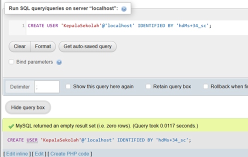
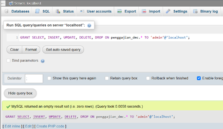

# Penggajian_SMP_IT_Darul_Muttaqin


Proyek dilakukan dengan proses wawancara langsung dan analisis data yang sudah ada, kemudian kami kelola dan diimplementasikan menjadi entitas serta relasi ke dalam database.

# Berikut ini adalah Step by stepnya

### 1. Membuat Database

```sql
CREATE DATABASE Penggajian_DMC 
CHARACTER SET utf8mb4 
COLLATE utf8mb4_general_ci;

```


### 2.	Membuat Tabel Karyawan

```sql
CREATE TABLE karyawan ( 
    ID_Karyawan INT AUTO_INCREMENT PRIMARY KEY, 
    Nama VARCHAR(100) NOT NULL, 
    NUPTK CHAR(16) UNIQUE NOT NULL 
) ENGINE=InnoDB; 

```


### 3.	Membuat Tabel Jabatan

```sql
CREATE TABLE Jabatan ( 
    ID_Jabatan INT AUTO_INCREMENT PRIMARY KEY, Nama_Jabatan VARCHAR(100) NOT NULL, 
    Jumlah_Honor DECIMAL(10,2) NOT NULL 
    ) ENGINE=InnoDB; 

```


### 4.	Membuat Tabel Transport

```sql
CREATE TABLE Transport ( 
    ID_Transport INT AUTO_INCREMENT PRIMARY KEY, Nilai_Per_Hari DECIMAL(10,2) NOT NULL 
    ) ENGINE=InnoDB;

```


### 5.	Membuat Tabel Honor

```sql
CREATE TABLE Honor ( 
    ID_Honor INT AUTO_INCREMENT PRIMARY KEY, Nilai_Per_Jam DECIMAL(10,2) NOT NULL
     ) ENGINE=InnoDB;

```


### 6.	Membuat Tabel Penggajian

```sql
CREATE TABLE Penggajian ( 
    ID_Gaji INT AUTO_INCREMENT PRIMARY KEY, 
    ID_Karyawan INT NOT NULL, 
    ID_Honor INT NOT NULL, 
    Jumlah_Jam INT NOT NULL, 
    ID_Transport INT NOT NULL, 
    Kehadiran INT NOT NULL, 
    ID_Jabatan INT, 
    Tanggal_Penggajian TIMESTAMP NOT NULL, 
    FOREIGN KEY (ID_Karyawan) REFERENCES Karyawan(ID_Karyawan) ON DELETE CASCADE ON UPDATE CASCADE, FOREIGN KEY (ID_Honor) REFERENCES Honor(ID_Honor) ON DELETE CASCADE ON UPDATE CASCADE, FOREIGN KEY (ID_Transport) REFERENCES Transport(ID_Transport) ON DELETE CASCADE ON UPDATE CASCADE, FOREIGN KEY (ID_Jabatan) REFERENCES Jabatan(ID_Jabatan) ON DELETE CASCADE ON UPDATE CASCADE ) ENGINE=InnoDB;
```


### 7.	Menunjukkan tabel pada Database Penggajian_DMC

```sql
show tables;
```


### 8.	Insert values ke tabel Karyawan

```sql
INSERT INTO Karyawan (Nama, NUPTK) VALUES
('Budi Pathurohman, S.Pd., Gr.', 1023456789012345),
('Yanti Susanti, S.Pd.', 2023456789012345),
('Muhamad Salim', 3023456789012345),
('Dede Hamdani, S.Pd.I.', 4023456789012345),
('Usep Supriatna, S.Pd.', 5023456789012345),
('Iyul Yulinar, S.Pd.', 6023456789012345),
('Hadi Pamungkas, S.Pd.', 7023456789012345),
('Rani Dwi Rahayu, S.Pd.', 8023456789012345),
('Ajat Munajat, S.Pd.', 9023456789012345),
('Widy Mauliddina, S.Sn.', 1002345678901234),
('Ria Elviana, M.Pd.', 1102345678901234),
('Mohammad Tohirin, S.Pd.', 1202345678901234),
('Dini Aprilia Ghasani H, S.Pd.', 1302345678901234),
('Wahyu Rustan Diyatman, S.Pd.', 1402345678901234),
('Dzaky Jundullah Nur El Haq, S.Pd., M.Pd.', 1502345678901234),
('Mulyana Chandra, S.Pd.', 1602345678901234),
('Susan Susana Widiana, S.Pd.', 1702345678901234),
('Fadhalna Yuniarti Maulid, S.Pd.', 1802345678901234),
('Embi Lilis, S.Si., Gr.', 1902345678901234),
('Muhamad Sulton Yasir, S.Pd.', 2002345678901234);

```


### 9.	Melihat field tabel Karyawan

```sql
desc karyawan;
```


### 10.	 Select untuk melihat Insert yang sudah ditambah-kan 

```sql
SELECT * FROM `karyawan`
```


### 11.	Insert values ke tabel Jabatan

```sql
INSERT INTO jabatan (Nama_Jabatan, Jumlah_Honor) VALUES ('Wali Kelas IX C', 100000), ('Wali Kelas VIII D', 100000), ('Waka Kurikulum', 400000), ('Wali Kelas IX A', 100000), ('Wali Kelas VIII A', 100000), ('Staf Kesiswaan', 250000), ('Wali Kelas IX B', 100000), ('Pembina OSIS', 150000), ('Waka Kesiswaan', 400000), ('Wali Kelas VII D', 100000), ('Wali Kelas VII B', 100000), ('Wali Kelas VIII C', 100000), ('Wali Kelas VIII B', 100000), ('Wali Kelas IX D', 100000), ('Wali Kelas VII C', 100000), ('Kepala Sekolah', 500000), ('Wali Kelas VII A', 100000), ('Guru Mata Pelajaran Matematika', 300000), ('Guru Mata Pelajaran Bahasa Indonesia', 300000), ('Guru Mata Pelajaran IPA', 300000);
```


### 12.	Melihat fields tabel Jabatan

```sql
desc jabatan;
```


### 13.	Select untuk melihat Insert yang sudah ditambah-kan

```sql
SELECT * FROM `jabatan`
```


### 14.	Insert values ke tabel Transport

```sql
INSERT INTO transport (Nilai_Per_Hari) VALUES (30000), (35000), (40000), (25000), (28000), (32000), (31000), (33000), (34000), (36000), (37000), (29000), (38000), (39000), (41000), (42000), (43000), (44000), (45000), (46000);
```


### 15.	Melihat fields tabel Transport

```sql
desc transport;
```


### 16.	Select untuk melihat Insert yang sudah ditambah-kan

```sql
SELECT * FROM `transport`
```


### 17.	Insert values ke tabel Honor

```sql
INSERT INTO honor (Nilai_Per_Jam) VALUES (17500), (18000), (19000), (20000), (21000), (22000), (23000), (24000), (25000), (26000), (27000), (28000), (29000), (30000), (31000), (32000), (33000), (34000), (35000), (36000);
```


### 18.	Melihat fields tabel Honor

```sql
desc honor;
```


### 19.	Select untuk melihat Insert yang sudah ditambah-kan

```sql
SELECT * FROM `honor`
```


### 20.	Insert values ke tabel
Pengajian

```sql
INSERT INTO Penggajian (ID_Karyawan, ID_Honor, Jumlah_Jam, ID_Transport, Kehadiran, ID_Jabatan, Tanggal_Penggajian) VALUES
(1, 1, 16, 1, 8, 1, CURRENT_TIMESTAMP()),(2, 1, 32, 1, 20, 2, CURRENT_TIMESTAMP()),(3, 1, 32, 1, 20, 3, CURRENT_TIMESTAMP()),(4, 1, 16, 1, 8, 4, CURRENT_TIMESTAMP()),(5, 1, 16, 1, 12, NULL, CURRENT_TIMESTAMP()),  (6, 1, 32, 1, 20, 5, CURRENT_TIMESTAMP()),(7, 1, 40, 1, 20, 6, CURRENT_TIMESTAMP()),(8, 1, 24, 1, 20, 7, CURRENT_TIMESTAMP()),(9, 1, 32, 1, 15, 8, CURRENT_TIMESTAMP()),(10, 1, 24, 1, 20, 9, CURRENT_TIMESTAMP()),(11, 1, 16, 1, 8, NULL, CURRENT_TIMESTAMP()), (12, 1, 8, 1, 8, NULL, CURRENT_TIMESTAMP()),(13, 1, 16, 1, 8, 10, CURRENT_TIMESTAMP()),(14, 1, 32, 1, 20, 11, CURRENT_TIMESTAMP()),(15, 1, 24, 1, 16, NULL, CURRENT_TIMESTAMP()),  (16, 1, 24, 1, 7, 12, CURRENT_TIMESTAMP()),(17, 1, 24, 1, 11, NULL, CURRENT_TIMESTAMP()), (18, 1, 24, 1, 16, 13, CURRENT_TIMESTAMP()),(19, 1, 16, 1, 7, NULL, CURRENT_TIMESTAMP()),(20, 1, 16, 1, 10, 14, CURRENT_TIMESTAMP());

```


### 21.	Melihat fields tabel Penggajian

```sql
desc penggajian;
```


### 22.	Select untuk melihat Insert yang sudah ditambah-kan

```sql
SELECT * FROM `penggajian`
```


### 23. mendapatkan Laporan Detail Penggajian per Karyawan

```sql
SELECT 
    p.ID_Gaji, 
    k.Nama AS Nama_Karyawan, 
    p.Jumlah_Jam,                     
    p.Kehadiran,                      
    FORMAT((p.Jumlah_Jam * h.Nilai_Per_Jam) + 0, 0, 'de_DE') AS Jumlah_Honor,
    FORMAT((p.Kehadiran * t.Nilai_Per_Hari) + 0, 0, 'de_DE') AS Jumlah_Transport,
    FORMAT(IFNULL(j.Jumlah_Honor, 0) + 0, 0, 'de_DE') AS Jumlah_Jabatan,
    FORMAT(((p.Jumlah_Jam * h.Nilai_Per_Jam) + (p.Kehadiran * t.Nilai_Per_Hari) + IFNULL(j.Jumlah_Honor, 0)) + 0, 0, 'de_DE') AS Total_Gaji
FROM penggajian p
JOIN karyawan k ON p.ID_Karyawan = k.ID_Karyawan
JOIN honor h ON p.ID_Honor = h.ID_Honor
JOIN transport t ON p.ID_Transport = t.ID_Transport
LEFT JOIN jabatan j ON p.ID_Jabatan = j.ID_Jabatan;

```


### 24.	Join untuk mendapat-
kan Laporan Total Penggajian per Bulan


```sql
SELECT 
    MONTH(p.Tanggal_Penggajian) AS Bulan,
    YEAR(p.Tanggal_Penggajian) AS Tahun,
    FORMAT(SUM((p.Jumlah_Jam * h.Nilai_Per_Jam) + (p.Kehadiran * t.Nilai_Per_Hari) + IFNULL(j.Jumlah_Honor, 0)), 0, 'de_DE') AS Total_Gaji
FROM penggajian p
JOIN honor h ON p.ID_Honor = h.ID_Honor
JOIN transport t ON p.ID_Transport = t.ID_Transport
LEFT JOIN jabatan j ON p.ID_Jabatan = j.ID_Jabatan
GROUP BY YEAR(p.Tanggal_Penggajian), MONTH(p.Tanggal_Penggajian)
ORDER BY Tahun DESC, Bulan DESC;

```


### 25.	Perintah Update pada Tabel Jabatan

```sql
UPDATE jabatan SET Nama_Jabatan = 'Asisten Kesiswaan', Jumlah_Honor = 300000 WHERE Nama_Jabatan = 'Staf Kesiswaan';
```


### 26.	Perintah Delete pada Tabel Transport

```sql
DELETE FROM transport WHERE Nilai_Per_Hari > 20000 AND Nilai_Per_Hari < 31000;
```


# B.	Implementasikan konsep Transaction

### 1.	Atomicity manual transaksi sukses

```sql
START TRANSACTION;

INSERT INTO penggajian (ID_Karyawan, ID_Honor, Jumlah_Jam, ID_Transport, Kehadiran, ID_Jabatan, Tanggal_Penggajian)
VALUES (21, 1, 20, 1, 20, NULL, CURRENT_TIMESTAMP());
INSERT INTO penggajian (ID_Karyawan, ID_Honor, Jumlah_Jam, ID_Transport, Kehadiran, ID_Jabatan, Tanggal_Penggajian)
VALUES (22, 1, 18, 1, 22, NULL, CURRENT_TIMESTAMP());

COMMIT;
```


### 2.	Atomicity manual transaksi batal /rollback pada Penggajian

```sql
START TRANSACTION;
DELETE FROM penggajian WHERE ID_Gaji = 1;
DELETE FROM penggajian WHERE ID_Gaji = 2;
ROLLBACK;

```

Data id_gaji=1 dan ID_Gaji = 2 sudah dihapus, namun belum di rollback

Tampilan data kembali ketika sudah dilakukan rollback

### 3.	Consistency Invalid Update pada penggajian

```sql
START TRANSACTION;
UPDATE penggajian SET ID_Honor = NULL WHERE ID_Gaji = 1;
ID_Honor tidak boleh NULL
COMMIT;

```

Meskipun sudah melakukan commit, tetapi jika data yang diinput tidak sesuai maka akan invalid

### 4.	Isolation (isolasi antar transaksi pada Penggajian)

```sql
START TRANSACTION;
UPDATE penggajian 
SET Jumlah_Jam = Jumlah_Jam + 5 
WHERE ID_Karyawan = 1;

SELECT * FROM penggajian WHERE ID_Karyawan = 1 FOR UPDATE;
UPDATE penggajian 
SET Kehadiran = Kehadiran - 1 
WHERE ID_Karyawan = 1;

COMMIT;

```

Telah meninput 2 perintah, namun yang dieksekusi perintah pertama

Setelah perintah di atas selesai, baru perintah kedua dijalankan, maka kehadiran baru akan berkurang.


# C.	Buatkan skenario apabila ada kesalahan maka seluruh transaksi batal

```sql
START TRANSACTION;
DECLARE EXIT HANDLER FOR SQLEXCEPTION
BEGIN
    ROLLBACK;
    SELECT 'ada kesalahan pengisian, ualngi kembali.' AS Error_Message;
END;
UPDATE penggajian 
SET Jumlah_Jam = Jumlah_Jam - 10 
WHERE ID_Karyawan = 1;
UPDATE penggajian 
SET Kehadiran = NULL  
WHERE ID_Karyawan = 2;
COMMIT;

```

Ilustrasi jika terjadi pengisian data yang salah maka tidak akan berhasil dan data tidak akan berubah karena rollback.

# 3.	Implementasikan User Management ke Database

### A.	Siapa aja yang boleh akses ke Database
Role yang bisa mengakses Database Penggajian_DMC adalah user root, admin, KepalaSekolah dan umum.

###  B.	Siapa aja yang boleh input data
Sedangkan yang bisa menginput data hanyalah user root dan admin saja. 

### C.	Siapa aja yang cuman boleh Query Select
Untuk user yang bisa melakukan Query Select atau user yang hanya bisa melakukan kegiatan “melihat” adalah user KepalaSekolah dan umum.


### D. Proses membuat banyak user dengan privileged tertentu


#### 1.	 Membuat beberapa account/user

```sql
CREATE USER 'admin'@'localhost' IDENTIFIED BY 'Gbsd+372ok';
```


```sql
CREATE USER 'KepalaSekolah'@'localhost' IDENTIFIED BY 'hdMs+34_sc';
```


```sql
CREATE USER 'umum'@'localhost' IDENTIFIED BY 'g3n4Gbsd+_y';
```


#### 2.	Memberikan hak akses untuk masing-masing user yang baru dibuat

```sql
GRANT SELECT, INSERT, UPDATE, DELETE, DROP ON penggajian_dmc.* TO 'admin'@'localhost';
```


```sql
GRANT SELECT ON penggajian_dmc.* TO 'KepalaSekolah'@'localhost';
```


```sql
GRANT SELECT ON penggajian_dmc.* TO 'umum'@'localhost';
```


#### 3.	Melakukan muat ulang

```sql
FLUSH PRIVILEGES;
```


#### 4.	Menampil-kan hak akses yang sudah ditambahkan

```sql
SHOW GRANTS FOR 'admin'@'localhost';
```


```sql
SHOW GRANTS FOR 'KepalaSekolah'@'localhost';
```


```sql
SHOW GRANTS FOR 'umum'@'localhost';
```


####  5.	Daftar user pada localhost
